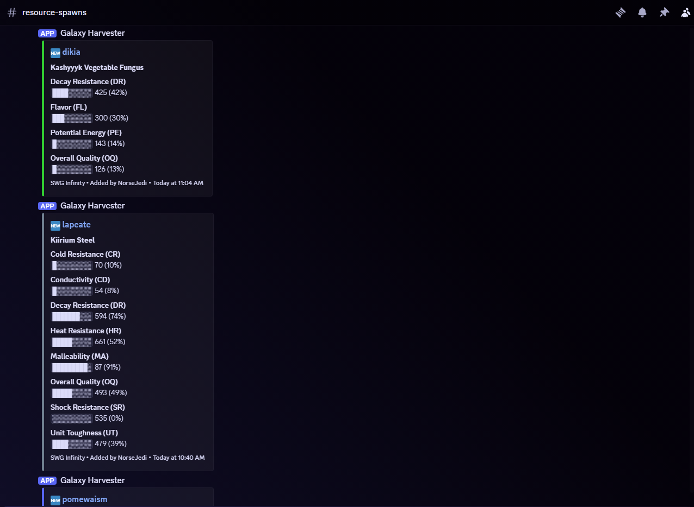

# GHFeedHook
This script reads the output from feedburner and sends a discord webhook if there is a update.

## 1. Clone the repo to your host
`git clone https://github.com/xyberviri/GHFeedHook/`

## 2. Copy the example env file
`cp .env.example .env`

## 3.  Fill in your webhook URL, Galaxy ID, & Galaxy name
`nano .env # set WEBHOOK_URL, GALAXY_ID, GALAXY_NAME`

## 4. Build the image
`docker compose build`

## 5. Start it (detached, auto-restarts on reboot)
`docker compose up -d`

# Other useful commands

## Watch live logs
`docker compose logs -f`

## Stop the bot
`docker compose down`

## Rebuild after changing the .py file
`docker compose up -d --build`
